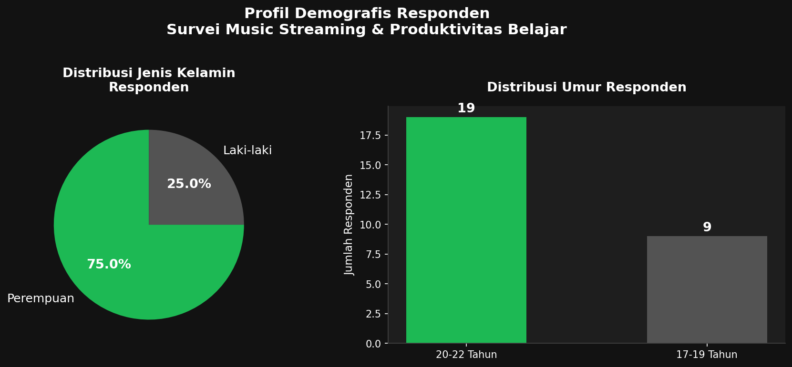
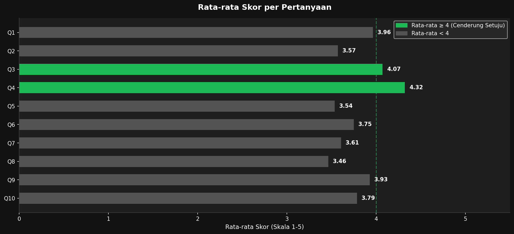
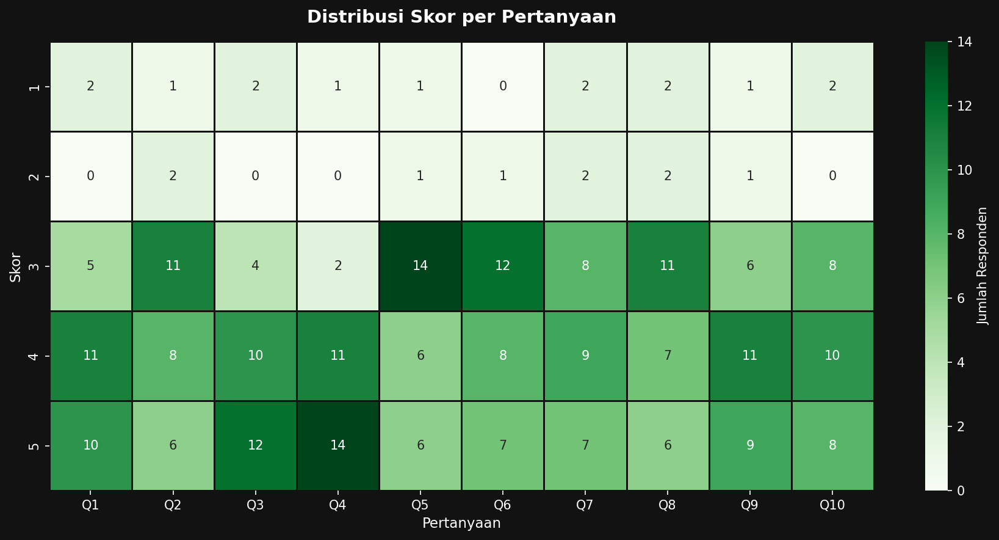
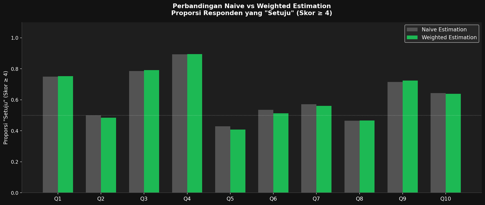

# nonprobability-survey

# 🎵 Analisis Non-Probability Sampling pada Survei Penggunaan Music Streaming terhadap Produktivitas Belajar Mahasiswa

---

## Latar Belakang

Perkembangan platform *music streaming* seperti Spotify dan YouTube Music telah mengubah cara mahasiswa dalam mengakses musik sehari-hari, termasuk saat belajar. Musik kerap dijadikan teman belajar dengan harapan dapat meningkatkan fokus, semangat, dan produktivitas.

Namun, pertanyaan mengenai sejauh mana musik benar-benar berdampak positif terhadap produktivitas belajar mahasiswa masih menarik untuk dikaji secara empiris. Oleh karena itu, penelitian ini dilakukan melalui survei online kepada mahasiswa Program Studi Statistika Universitas Mataram menggunakan metode **non-probability sampling** dengan pendekatan *convenience sampling*.

## Tujuan

Tujuan dari penelitian ini adalah:
- Mengetahui persepsi mahasiswa Statistika UNRAM terhadap pengaruh *music streaming* terhadap produktivitas belajar.
- Mendeskripsikan distribusi demografis responden berdasarkan jenis kelamin dan umur.
- Menghitung **naive estimation** proporsi mahasiswa yang setuju musik berdampak positif terhadap produktivitas belajar.
- Melakukan **weighted estimation** berdasarkan jenis kelamin untuk memperoleh hasil estimasi yang lebih representatif terhadap populasi.
- Membandingkan hasil naive estimation dan weighted estimation.

## Metode

Penelitian ini merupakan penelitian kuantitatif dengan pendekatan survei online. Data diperoleh melalui penyebaran kuesioner menggunakan Google Form kepada mahasiswa Statistika Universitas Mataram.

Teknik sampling yang digunakan adalah **non-probability sampling** dengan metode *convenience sampling*, yaitu pengambilan sampel berdasarkan kemudahan memperoleh responden. Jumlah responden dalam penelitian ini sebanyak **28 mahasiswa**.

Pengolahan data dilakukan menggunakan bahasa pemrograman **Python** dengan library `pandas`, `matplotlib`, `seaborn`, dan `numpy`. Analisis dilakukan menggunakan script pada file `analisis_music_streaming.ipynb`.

## Variabel Penelitian

### Bagian A – Identitas Responden
1. Jenis Kelamin (Laki-laki / Perempuan)
2. Umur (17–19 / 20–22 / 23–25 / >25 tahun)

### Bagian B – Pertanyaan Skala Likert 1–5
*(1 = Sangat Tidak Setuju, 5 = Sangat Setuju)*

| Kode | Pertanyaan |
|------|-----------|
| Q1 | Saya menggunakan platform *music streaming* (Spotify, YouTube Music, dll.) saat belajar. |
| Q2 | Mendengarkan musik membantu saya lebih fokus saat mengerjakan tugas. |
| Q3 | Saya merasa lebih semangat belajar ketika ditemani musik. |
| Q4 | Musik membantu saya mengurangi rasa bosan saat belajar. |
| Q5 | Saya lebih cepat menyelesaikan tugas ketika mendengarkan musik. |
| Q6 | Musik yang saya dengarkan tidak mengganggu konsentrasi saya. |
| Q7 | Saya merasa produktivitas belajar saya meningkat dengan adanya musik. |
| Q8 | Saya lebih nyaman belajar di tempat yang ada musik dibanding yang sunyi. |
| Q9 | Saya secara aktif memilih *playlist* tertentu untuk menemani waktu belajar. |
| Q10 | Secara keseluruhan, *music streaming* memberikan dampak positif terhadap produktivitas belajar saya. |

## Tahapan Analisis Data

### 1. Import Library

```python
import pandas as pd
import matplotlib.pyplot as plt
import matplotlib.patches as mpatches
import seaborn as sns
import numpy as np
```

---

### 2. Load & Persiapan Data

Data hasil survei diimpor dari file CSV, kemudian kolom yang tidak diperlukan (Timestamp, Nama, Program Studi, Semester) dihapus. Kolom pertanyaan diubah menjadi label Q1–Q10 agar lebih ringkas.

```python
df_raw = pd.read_csv('Form_Responses_1.csv')

df = df_raw.drop(columns=['Timestamp', 'Nama', 'Program Studi', 'Semester'])

q_cols = [c for c in df.columns if c not in ['Jenis Kelamin', 'Umur']]
q_labels = [f'Q{i+1}' for i in range(len(q_cols))]
df = df.rename(columns=dict(zip(q_cols, q_labels)))
```

---

### 3. Analisis Deskriptif

Analisis deskriptif dilakukan untuk mengetahui distribusi responden berdasarkan jenis kelamin dan umur, serta statistik deskriptif skor setiap pertanyaan.

```python
print(df['Jenis Kelamin'].value_counts())
print(df['Umur'].value_counts())

desc = df[q_labels].describe().T
```

---

### 4. Naive Estimation

Naive estimation menghitung proporsi responden yang menjawab **"Setuju"** (skor ≥ 4) secara langsung tanpa koreksi bias.

$$\hat{P} = \frac{\text{Jumlah Setuju (skor} \geq 4\text{)}}{\text{Total Responden}}$$

```python
naive = {}
for q in q_labels:
    setuju = (df[q] >= 4).sum()
    total = len(df)
    naive[q] = setuju / total
```

---

### 5. Weighted Estimation

Weighted estimation mengoreksi bias sampling dengan membandingkan proporsi populasi terhadap proporsi sampel berdasarkan jenis kelamin.

$$w_i = \frac{\text{Proporsi Populasi}_i}{\text{Proporsi Sampel}_i}$$

```python
# Proporsi populasi (Statistika UNRAM: 126 perempuan, 31 laki-laki, total 157)
pop_P = 126 / 157
pop_L = 31 / 157

# Proporsi sampel
samp_P = n_P / n
samp_L = n_L / n

# Hitung bobot
w_P = pop_P / samp_P
w_L = pop_L / samp_L

# Terapkan bobot
df['weight'] = df['Jenis Kelamin'].map({'Perempuan': w_P, 'Laki-laki': w_L})

weighted = {}
for q in q_labels:
    df['setuju_q'] = (df[q] >= 4).astype(int)
    w_setuju = (df['setuju_q'] * df['weight']).sum()
    w_total = df['weight'].sum()
    weighted[q] = w_setuju / w_total
```

---

### 6. Perbandingan Estimasi

Tabel perbandingan antara hasil naive estimation dan weighted estimation dibuat untuk melihat seberapa besar koreksi yang dihasilkan setelah pembobotan.

```python
comparison = pd.DataFrame({
    'Pertanyaan': [pertanyaan[q] for q in q_labels],
    'Naive (%)': [f"{naive[q]*100:.2f}%" for q in q_labels],
    'Weighted (%)': [f"{weighted[q]*100:.2f}%" for q in q_labels],
    'Selisih (pp)': [f"{(weighted[q]-naive[q])*100:+.2f}" for q in q_labels]
}, index=q_labels)
```

## Hasil dan Pembahasan

### Profil Demografis Responden

Survei diikuti oleh **28 mahasiswa** Statistika UNRAM dengan distribusi sebagai berikut:

| Jenis Kelamin | Frekuensi | Persentase |
|---|---|---|
| Perempuan | 21 | 75,0% |
| Laki-laki | 7 | 25,0% |
| **Total** | **28** | **100%** |

| Umur | Frekuensi |
|---|---|
| 20–22 Tahun | 19 |
| 17–19 Tahun | 9 |

Mayoritas responden berjenis kelamin perempuan (75%) dan berada pada rentang usia 20–22 tahun.

### Grafik Distribusi Demografis



### Rata-rata Skor per Pertanyaan

Berdasarkan hasil analisis, rata-rata skor tiap pertanyaan berkisar antara 3,46 hingga 4,32 pada skala 1–5.

- **Q4** (Musik mengurangi rasa bosan) memperoleh skor rata-rata tertinggi: **4,32**
- **Q3** (Lebih semangat belajar dengan musik) memperoleh skor rata-rata: **4,07**
- **Q8** (Lebih nyaman belajar dengan musik) memperoleh skor rata-rata terendah: **3,46**



### Distribusi Skor per Pertanyaan



### Naive Estimation

Naive estimation dihitung sebagai proporsi responden yang menjawab skor ≥ 4 pada setiap pertanyaan tanpa pembobotan.

| Kode | Pertanyaan | Naive (%) |
|------|-----------|-----------|
| Q1 | Menggunakan *music streaming* saat belajar | 75,00% |
| Q2 | Musik membantu lebih fokus | 50,00% |
| Q3 | Lebih semangat belajar dengan musik | 78,57% |
| Q4 | Musik mengurangi rasa bosan | 89,29% |
| Q5 | Lebih cepat menyelesaikan tugas | 42,86% |
| Q6 | Musik tidak mengganggu konsentrasi | 53,57% |
| Q7 | Produktivitas meningkat dengan musik | 57,14% |
| Q8 | Lebih nyaman belajar dengan musik | 46,43% |
| Q9 | Aktif memilih *playlist* untuk belajar | 71,43% |
| Q10 | *Music streaming* berdampak positif | 64,29% |

### Weighted Estimation

Bobot dihitung berdasarkan perbandingan proporsi populasi dan proporsi sampel menurut jenis kelamin:

| Jenis Kelamin | Proporsi Populasi | Proporsi Sampel | Bobot |
|---|---|---|---|
| Perempuan | 0,8025 | 0,7500 | ~1,070 |
| Laki-laki | 0,1975 | 0,2500 | ~0,790 |

Karena laki-laki **over-represented** di sampel (25%) dibanding populasi (19,75%), bobotnya diturunkan. Sebaliknya, bobot perempuan sedikit dinaikkan.

### Perbandingan Naive vs Weighted Estimation



Selisih antara naive dan weighted estimation relatif kecil (< 2 *percentage points*) pada semua pertanyaan, yang menunjukkan bahwa distribusi sampel sudah cukup mendekati kondisi populasi sesungguhnya.

## Kesimpulan

Berdasarkan hasil analisis non-probability sampling pada survei penggunaan *music streaming* terhadap produktivitas belajar mahasiswa Statistika UNRAM, diperoleh temuan sebagai berikut:

1. Mayoritas mahasiswa (89,29%) setuju bahwa musik membantu mengurangi rasa bosan saat belajar (Q4), menjadikannya aspek yang paling dirasakan manfaatnya.
2. Aspek yang paling rendah tingkat persetujuannya adalah Q5 (lebih cepat menyelesaikan tugas dengan musik) dengan proporsi 42,86%, menunjukkan bahwa tidak semua mahasiswa merasa musik meningkatkan kecepatan kerja mereka.
3. Perbedaan hasil naive estimation dan weighted estimation sangat kecil, yang berarti distribusi sampel sudah cukup representatif terhadap populasi.
4. Secara keseluruhan, *music streaming* dipersepsikan memberikan dampak positif terhadap produktivitas belajar, terutama dalam hal semangat dan pengurangan kebosanan.

## Link Kuesioner

*(https://forms.gle/GRzrH3AzeHsfFerWA)*

## Penulis

**Abyan Arkan Maulana**  
Program Studi Statistika  
FMIPA Universitas Mataram  
2026
